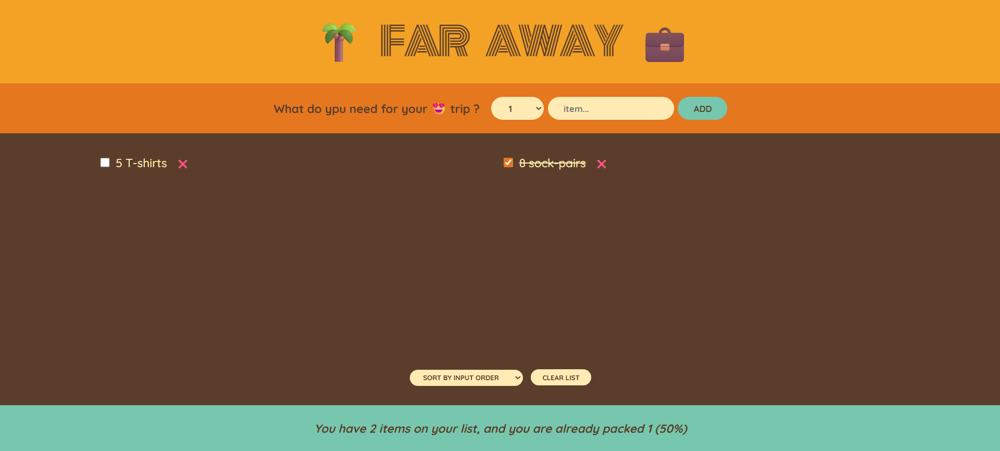

# Travel List (Far Away)

Simple React app to build a packing list for trips.



## Quick start

1. Install dependencies:

```bash
npm install
```

2. Run in development:

```bash

npm start

```

## ✨ Features

-Add items with quantity using the form (src/Form.js) via handleSubmit.

-Toggle packed state and remove items (src/Item.js).

-Sort and clear the list (src/PackingList.js).

-View summary stats (src/Stats.js).

-App handlers managed in src/App.js:

handleItems

handleDeleteItems

handleToggleItem

handleResetItems

Logo component for branding (src/Logo.js).

## Project files 📂

src/
├─ App.js # Main component and state management

├─ Form.js # Add-item form (uses handleSubmit)

├─ Item.js # Single item row (props: item, onDeleteItem, onToggleItem)

├─ PackingList.js # List rendering, sorting, and actions

├─ Stats.js # Footer stats

├─ Logo.js # Header component

├─ index.js # React bootstrap

public/
├─ index.html # HTML template
package.json # Scripts & dependencies
